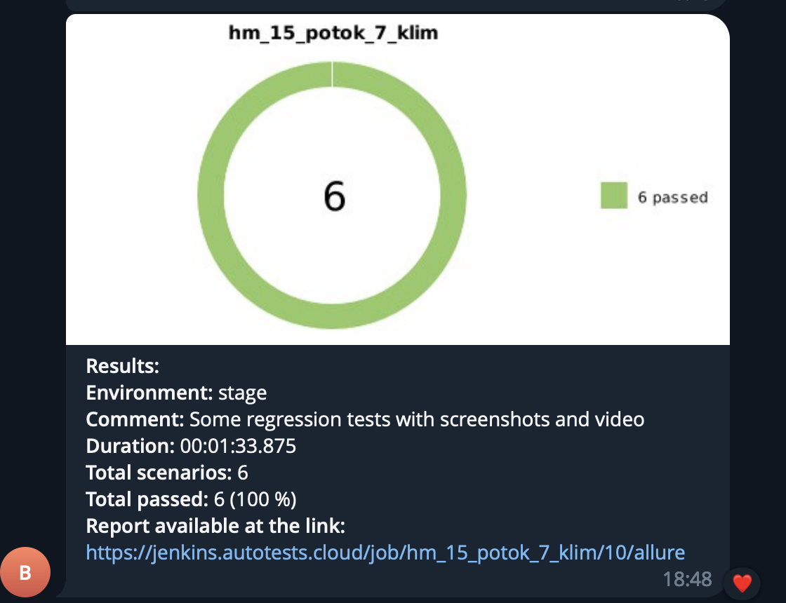
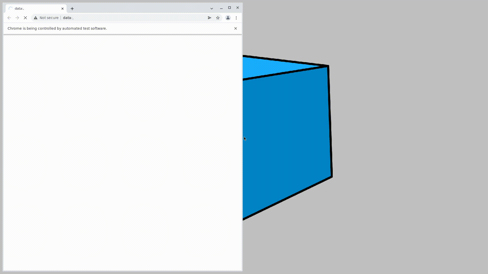

# qaguru_hm15
Hello! This is my homework qa guru lesson 15 potok 7
# Vacancies page testing <a target="_blank" href="https://azalianow.ru"</a>

### Technology stack:

<code></code>
<code></code>
<code></code>
<code></code>
<code></code>
<code></code>
<code></code>

### For running autotests you should execute steps:

1. Open project in Jenkins via <a target="_blank" href=" https://jenkins.autotests.cloud/job/hm_15_potok_7_klim/">link</a> 
2. Click on 'Build now' button

### Allure Reports

After passing all cases you can see allure-reports (Allure Report):

### Telegram alert

### Video Example with passing one autotest

          
          
          
          